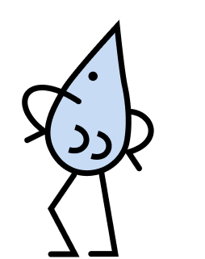
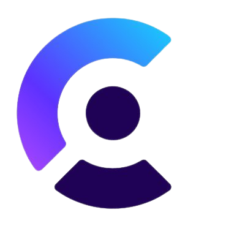

# Nude Project Redesign
Welcome to my redesign of the Nude Project website ([original](https://nude-project.com/)). You can watch this project deployed [<i>here</i>](https://nude-project-redesign.vercel.app/).

**WARNING: This project is not official and Nude Project® is not related to it. This is just a redesign to showcase my skills and nothing can be purchased from it.**

## Features
- Authentication via [Clerk](https://clerk.com/) (Oauth sign-up with Google, GitHub, and Discord, email and password sign-up, reset password)
- Newsletter (unsubscribe option available on the newsletter email)
- Shopping cart (no checkout or payment available as suplantation is not intended)
- Search bar
- All products page
- Category search
- Filtering and sorting
- Full responsive (followed mobile-first approach)
- Theme selector (light and dark)
- Collapsed menu nav in mobile view
- About and stores pages

## Technologies
These are the technologies I have used to build this awesome website:

## Views from the website

  

